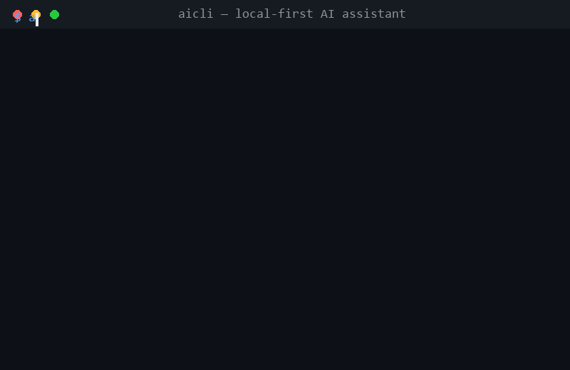

<div align="center">

# aicli

**Local-first AI assistant for your terminal**

Works with **Ollama** out of the box (free, private, no API key) — and switches to **OpenAI** or **OpenRouter** with one flag.

[](https://www.python.org/downloads/)
[](https://github.com/linxi-667/aicli/actions/workflows/ci.yml)
[](LICENSE)

<br/>



</div>

---

`aicli` is a minimal, dependency-light AI assistant for your terminal. It talks to **Ollama** locally with zero configuration and zero cost, and can use **OpenAI** or **OpenRouter** cloud models with a single flag. No config file, no daemon — just a command.

## ✨ Features

- 🏠 **Local-first** — runs against your local Ollama models; your prompts never leave your machine
- 🔌 **Multi-provider** — Ollama / OpenAI / OpenRouter, switch with `--provider`
- ⚡ **One-liner chat** — `aicli chat "explain TCP handshake like I'm 5"`
- 💬 **Interactive REPL** — run `aicli chat` for a persistent session
- 📦 **Streaming output** — tokens stream to your terminal as they arrive
- 🪶 **Minimal** — only 4 runtime dependencies (`click`, `httpx`, `rich`, `python-dotenv`)
- 🧪 **Tested** — offline unit tests, CI on Python 3.10–3.13

## 📋 Requirements

- Python 3.10+
- [Ollama](https://ollama.com) *(optional — only needed for local models)*

## 🚀 Install

```bash
git clone https://github.com/linxi-667/aicli.git
cd aicli
pip install -e .
```

Or without git:

```bash
pip install -r requirements.txt
```

## ⚡ Quick Start

### 1. Local models with Ollama — no API key needed

```bash
ollama pull llama3.2                 # one-time model download
aicli chat --provider ollama --model llama3.2 "What is Rust?"
```

### 2. Cloud models — set a key once

```bash
export OPENAI_API_KEY=sk-...         # or add it to a .env file in the project root
aicli chat --provider openai --model gpt-4o-mini "Hi, who are you?"
```

### 3. Interactive session

```bash
aicli chat
```

```
you: what is a linked list?
ai: A linked list is a linear data structure where each element (node)
    holds a value and a pointer to the next node...
you: exit
```

## 📖 Usage

| Command | Description |
|---|---|
| `aicli chat "question"` | single-shot question |
| `aicli chat` | interactive REPL (exit with `exit` / `quit` / `Ctrl-C`) |
| `aicli chat --provider openrouter --model meta-llama/llama-3.3-70b-instruct "..."` | pick provider & model |
| `aicli chat --no-stream "..."` | disable streaming |
| `aicli models --provider ollama` | list models available on the provider |
| `aicli --help` | all commands and options |

## ⚙️ Configuration

Everything is configurable via environment variables or a `.env` file. No config file needed.

| Variable | Default | Description |
|---|---|---|
| `AICLI_PROVIDER` | `ollama` | default provider (`ollama` / `openai` / `openrouter`) |
| `AICLI_MODEL` | per-provider default | default model name |
| `OLLAMA_BASE_URL` | `http://localhost:11434` | Ollama endpoint |
| `OPENAI_API_KEY` | — | OpenAI API key |
| `OPENROUTER_API_KEY` | — | OpenRouter API key |

Example `.env`:

```bash
AICLI_PROVIDER=openrouter
OPENROUTER_API_KEY=sk-or-...
```

## 🔌 Providers

| Provider | Endpoint | Streaming | API key | Notes |
|---|---|---|---|---|
| Ollama | local `/api/chat` | ✅ | ❌ | free, private, offline |
| OpenAI | `api.openai.com/v1` | ✅ | ✅ | GPT-4o family |
| OpenRouter | `openrouter.ai/api/v1` | ✅ | ✅ | 300+ models behind one key |

## 🗂 Project layout

```
aicli/
├── aicli/
│   ├── cli.py          # click commands: chat / models
│   ├── providers.py    # Ollama / OpenAI / OpenRouter adapters
│   └── config.py       # env & .env handling
├── tests/              # offline unit tests (pytest)
├── pyproject.toml      # packaging & entry point
└── requirements.txt    # runtime deps
```

## 🧑‍💻 Development

```bash
pip install -e ".[dev]"
pytest
```

## 📄 License

[MIT](LICENSE) © [linxi-667](https://github.com/linxi-667)
